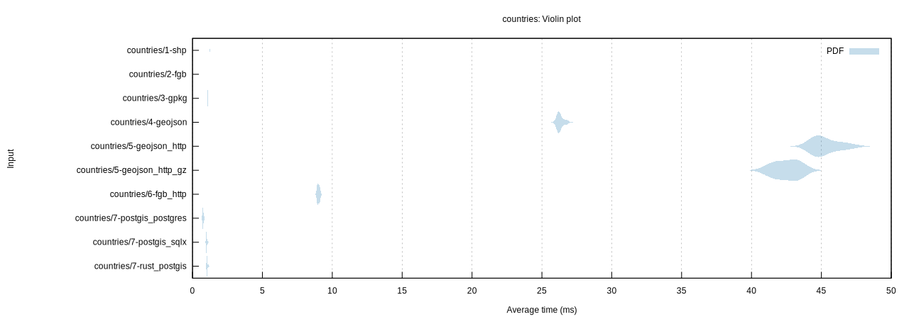
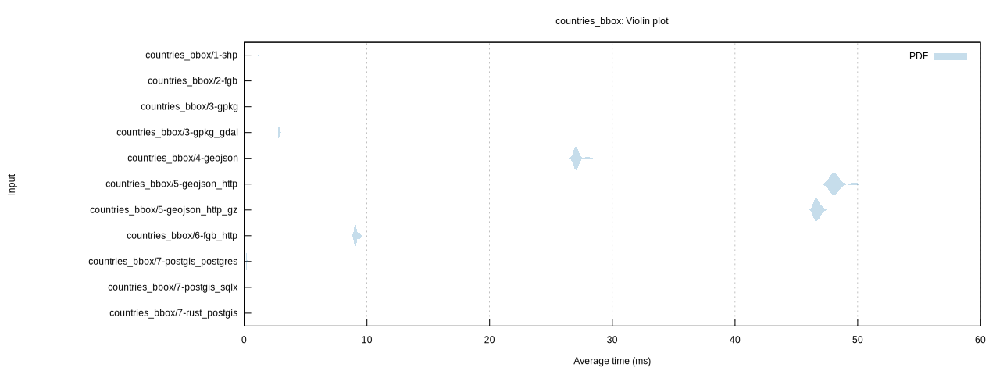
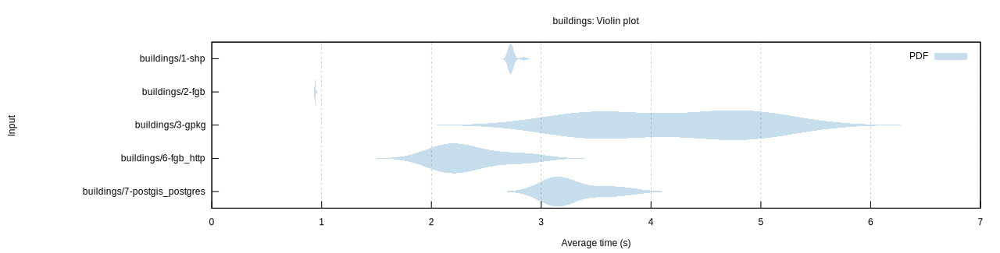
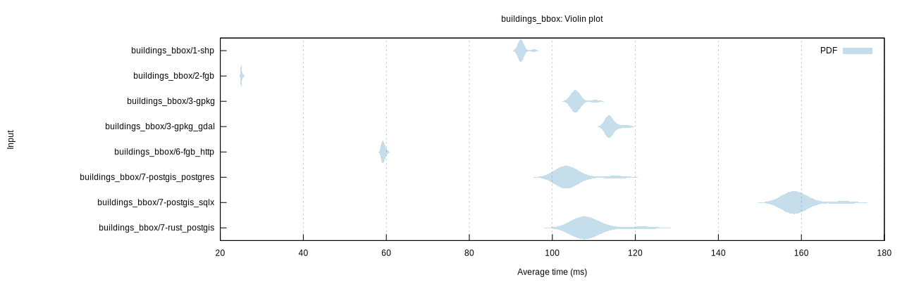

# GeoZero benchmark

## Benchmarks

* `countries`: Read all countries of the world as generalized polygons (GPKG size: 324KB)
* `countries_bbox`: Read 6/179 countries within a bounding box
* `buildings`: Read 2.4 Mio OSM building polygons (GPKG size: 764MB)
* `buildings_bbox`: Read 55'000 OSM building polygons within a bounding box

## Tested configurations

*  `shp`: Shapefile with GDAL driver
*  `fgb`: [FlatGeobuf](https://bjornharrtell.github.io/flatgeobuf/) file with Rust driver and GeoZero processor for `geo`
*  `gpkg`: [GeoPackage](https://www.geopackage.org/) file with GeoZero GPKG reader for [SQLx](https://github.com/launchbadge/sqlx) and processor for `geo`
*  `gpkg_gdal`: GeoPackage file with GDAL driver
*  `geojson`: GeoJSON file with GDAL driver
*  `geojson_http`: GeoJSON over HTTP (Nginx) with GDAL driver
*  `geojson_http_gz`: GeoJSON over HTTP (Nginx) with Gzip compression with GDAL driver
*  `fgb_http`: FlatGeobuf over HTTP (Nginx) with Rust driver and GeoZero processor for `geo`
*  `postgis_sqlx`: PostgreSQL DB with GeoZero PostGIS reader for [SQLx](https://github.com/launchbadge/sqlx) and processor for `geo`
*  `postgis_postgres`: PostgreSQL DB with GeoZero PostGIS reader for [rust-postgres](https://github.com/sfackler/rust-postgres) and processor for `geo`
*  `rust_postgis`: PostgreSQL DB with [rust-postgis](https://github.com/andelf/rust-postgis) reader for [rust-postgres](https://github.com/sfackler/rust-postgres)

Remark: All data is converted from the FlatGeobuf file and therefore has the same ordering.

## Results

| Benchmark | Median (ms) | Factor |
| --------- | ----------: | -----: |
| countries/1-shp | 1.22 | 1.00 |
| countries/2-fgb | 0.18 | 0.15 |
| countries/3-gpkg | 1.10 | 0.90 |
| countries/4-geojson | 26.22 | 21.56 |
| countries/5-geojson_http | 45.02 | 37.01 |
| countries/5-geojson_http_gz | 42.60 | 35.02 |
| countries/6-fgb_http | 9.00 | 7.40 |
| countries/7-postgis_postgres | 0.74 | 0.60 |
| countries/7-postgis_sqlx | 0.99 | 0.82 |
| countries/7-rust_postgis | 1.03 | 0.85 |

| Benchmark | Median (ms) | Factor |
| --------- | ----------: | -----: |
| countries_bbox/1-shp | 1.17 | 1.00 |
| countries_bbox/2-fgb | 0.02 | 0.02 |
| countries_bbox/3-gpkg | 0.65 | 0.56 |
| countries_bbox/3-gpkg_gdal | 2.83 | 2.42 |
| countries_bbox/4-geojson | 27.03 | 23.09 |
| countries_bbox/5-geojson_http | 48.09 | 41.08 |
| countries_bbox/5-geojson_http_gz | 46.64 | 39.84 |
| countries_bbox/6-fgb_http | 9.07 | 7.75 |
| countries_bbox/7-postgis_postgres | 0.20 | 0.17 |
| countries_bbox/7-postgis_sqlx | 0.15 | 0.12 |
| countries_bbox/7-rust_postgis | 0.21 | 0.18 |

| Benchmark | Median (s)  | Factor |
| --------- | ----------: | -----: |
| buildings/1-shp | 2.72 | 1.00 |
| buildings/2-fgb | 0.94 | 0.35 |
| buildings/3-gpkg | 4.30 | 1.58 |
| buildings/6-fgb_http | 2.25 | 0.83 |
| buildings/7-postgis_postgres | 3.16 | 1.16 |

| Benchmark | Median (ms) | Factor |
| --------- | ----------: | -----: |
| buildings_bbox/1-shp | 92.38 | 1.00 |
| buildings_bbox/2-fgb | 25.04 | 0.27 |
| buildings_bbox/3-gpkg | 105.55 | 1.14 |
| buildings_bbox/3-gpkg_gdal | 113.69 | 1.23 |
| buildings_bbox/6-fgb_http | 59.24 | 0.64 |
| buildings_bbox/7-postgis_postgres | 102.99 | 1.11 |
| buildings_bbox/7-postgis_sqlx | 158.40 | 1.71 |
| buildings_bbox/7-rust_postgis | 107.50 | 1.16 |

## Running the benchmark

Prepare data:

    cd tests/data
    make

Create PostGIS database:

    make createdb
    make countries_table osm_buildings_table

Start web server:

    docker-compose up -d
    cd ../..

Run benchmark:

    export DATABASE_URL=postgresql://$USER@localhost/geozerobench?sslmode=disable
    cargo bench
