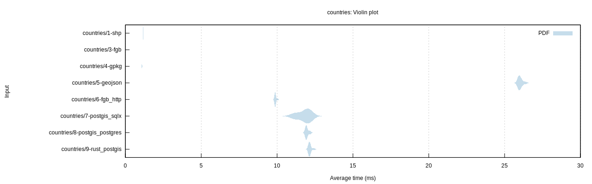
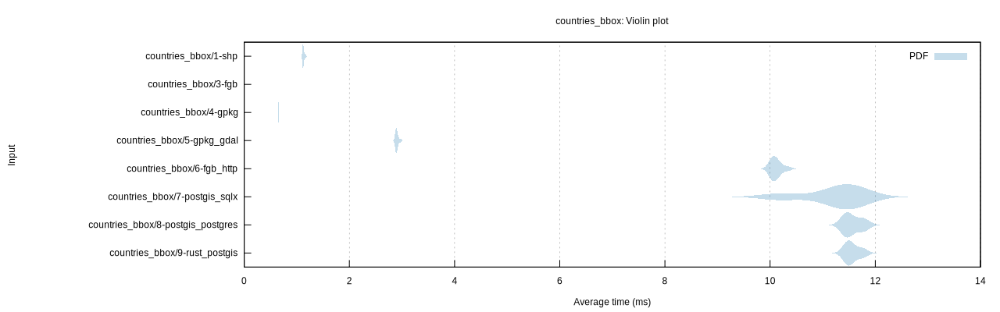
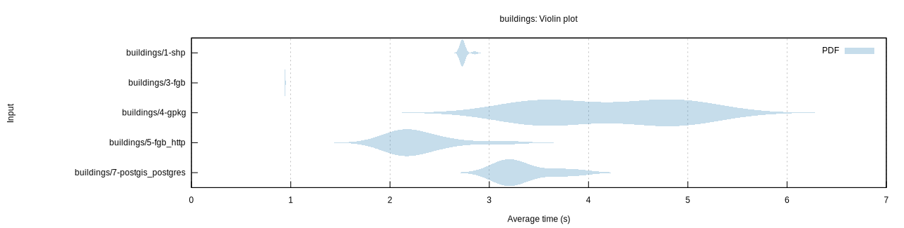
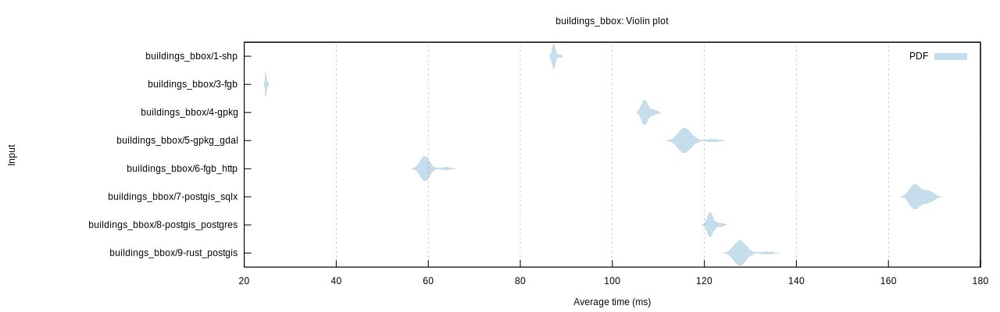

# GeoZero benchmark

## Benchmarks

* `countries`: Read all countries of the world as generalized polygons (GPKG size: 324KB)
* `countries_bbox`: Read 6/179 countries within a bounding box
* `buildings`: Read 2.4 Mio OSM building polygons (GPKG size: 764MB)
* `buildings_bbox`: Read 55'000 OSM building polygons within a bounding box

## Tested configurations

*  `shp`: Shapefile with GDAL driver
*  `fgb`: [FlatGeobuf](https://bjornharrtell.github.io/flatgeobuf/) file with Rust driver and GeoZero processor for `geo`
*  `gpkg`: [GeoPackage](https://www.geopackage.org/) file with GeoZero GPKG reader for [SQLx](https://github.com/launchbadge/sqlx) and processor for `geo`
*  `gpkg_gdal`: GeoPackage file with GDAL driver
*  `geojson`: GeoJSON file with GDAL driver
*  `fgb_http`: FlatGeobuf over HTTP (Nginx) with Rust driver and GeoZero processor for `geo`
*  `postgis_sqlx`: PostgreSQL DB with GeoZero PostGIS reader for [SQLx](https://github.com/launchbadge/sqlx) and processor for `geo`
*  `postgis_postgres`: PostgreSQL DB with GeoZero PostGIS reader for [rust-postgres](https://github.com/sfackler/rust-postgres) and processor for `geo`
*  `rust_postgis`: PostgreSQL DB with [rust-postgis](https://github.com/andelf/rust-postgis) reader for [rust-postgres](https://github.com/sfackler/rust-postgres)

Remark: All data is converted from the FlatGeobuf file and therefore has the same ordering.

## Results

| Benchmark | Median (ms) | Factor |
| --------- | ----------: | -----: |
| countries/1-shp | 1.17 | 1.00 |
| countries/3-fgb | 0.18 | 0.15 |
| countries/4-gpkg | 1.09 | 0.93 |
| countries/5-geojson | 25.97 | 22.21 |
| countries/6-fgb_http | 9.88 | 8.45 |
| countries/7-postgis_sqlx | 11.95 | 10.21 |
| countries/8-postgis_postgres | 11.93 | 10.20 |
| countries/9-rust_postgis | 12.14 | 10.38 |

| Benchmark | Median (ms) | Factor |
| --------- | ----------: | -----: |
| countries_bbox/1-shp | 1.12 | 1.00 |
| countries_bbox/3-fgb | 0.02 | 0.02 |
| countries_bbox/4-gpkg | 0.65 | 0.58 |
| countries_bbox/5-gpkg_gdal | 2.89 | 2.58 |
| countries_bbox/6-fgb_http | 10.09 | 9.01 |
| countries_bbox/7-postgis_sqlx | 11.39 | 10.17 |
| countries_bbox/8-postgis_postgres | 11.49 | 10.26 |
| countries_bbox/9-rust_postgis | 11.52 | 10.29 |

| Benchmark | Median (ms) | Factor |
| --------- | ----------: | -----: |
| buildings/1-shp | 2.73 | 1.00 |
| buildings/3-fgb | 0.94 | 0.35 |
| buildings/4-gpkg | 4.26 | 1.56 |
| buildings/5-fgb_http | 2.15 | 0.79 |
| buildings/7-postgis_postgres | 3.20 | 1.17 |

| Benchmark | Median (ms) | Factor |
| --------- | ----------: | -----: |
| buildings_bbox/1-shp | 87.27 | 1.00 |
| buildings_bbox/3-fgb | 24.65 | 0.28 |
| buildings_bbox/4-gpkg | 107.03 | 1.23 |
| buildings_bbox/5-gpkg_gdal | 115.66 | 1.33 |
| buildings_bbox/6-fgb_http | 59.34 | 0.68 |
| buildings_bbox/7-postgis_sqlx | 166.08 | 1.90 |
| buildings_bbox/8-postgis_postgres | 121.34 | 1.39 |
| buildings_bbox/9-rust_postgis | 127.80 | 1.46 |

## Running the benchmark

Prepare data:

    cd tests/data
    make

Create PostGIS database:

    make createdb
    make countries_table osm_buildings_table

Start web server:

    docker-compose up -d
    cd ../..

Run benchmark:

    export DATABASE_URL=postgresql://$USER@localhost/geozerobench?sslmode=disable
    cargo bench
