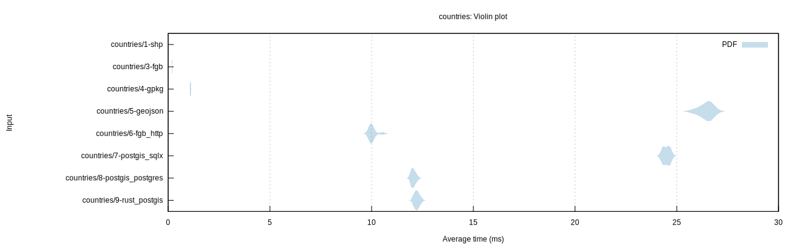
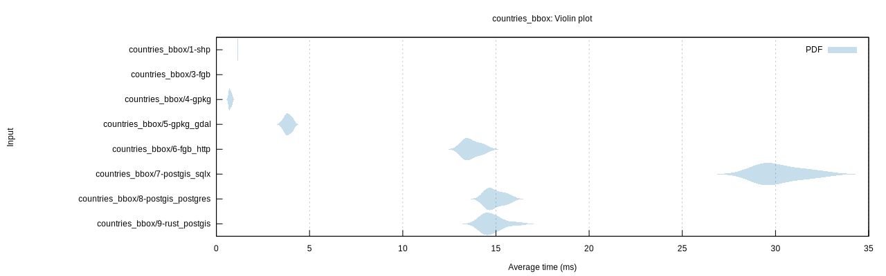
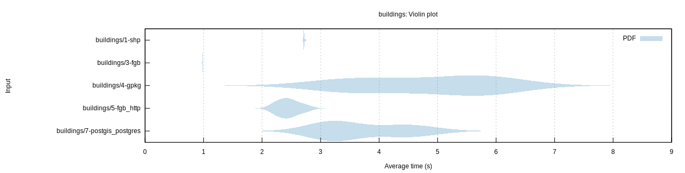
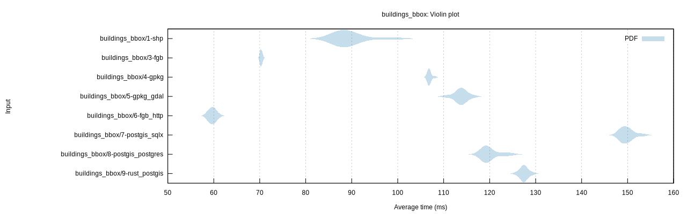

# GeoZero benchmark

## Benchmarks

* `countries`: Read all countries of the world as generalized polygons (GPKG size: 324KB)
* `countries_bbox`: Read 6/179 countries within a bounding box
* `buildings`: Read 2.4 Mio OSM building polygons (GPKG size: 764MB)
* `buildings_bbox`: Read 55'000 OSM building polygons within a bounding box

## Tested configurations

*  `shp`: Shapefile with GDAL driver
*  `fgb`: FlatGeobuf file with Rust driver and GeoZero processor for `geo`
*  `gpkg`: GeoPackage file with GeoZero GPKG reader for [SQLx](https://github.com/launchbadge/sqlx) and processor for `geo`
*  `gpkg_gdal`: GeoPackage file with GDAL driver
*  `geojson`: GeoJSON file with GDAL driver
*  `fgb_http`: FlatGeobuf over HTTP (Nginx) with Rust driver and GeoZero processor for `geo`
*  `postgis_sqlx`: PostgreSQL DB with GeoZero PostGIS reader for [SQLx](https://github.com/launchbadge/sqlx) and processor for `geo`
*  `postgis_postgres`: PostgreSQL DB with GeoZero PostGIS reader for [rust-postgres](https://github.com/sfackler/rust-postgres) and processor for `geo`
*  `rust_postgis`: PostgreSQL DB with [rust-postgis](https://github.com/andelf/rust-postgis) reader for [rust-postgres](https://github.com/sfackler/rust-postgres)

Remark: All data is converted from the FlatGeobuf file and therefore has the same ordering.

## Results

| Benchmark | Median (ms) |
| --------- | ----------: |
| countries/1-shp | 0.85 |
| countries/3-fgb | 0.20 |
| countries/4-gpkg | 1.10 |
| countries/5-geojson | 26.57 |
| countries/6-fgb_http | 9.97 |
| countries/7-postgis_sqlx | 24.51 |
| countries/8-postgis_postgres | 12.04 |
| countries/9-rust_postgis | 12.22 |

| Benchmark | Median (ms) |
| --------- | ----------: |
| countries_bbox/1-shp | 1.15 |
| countries_bbox/3-fgb | 0.03 |
| countries_bbox/4-gpkg | 0.72 |
| countries_bbox/5-gpkg_gdal | 3.83 |
| countries_bbox/6-fgb_http | 13.57 |
| countries_bbox/7-postgis_sqlx | 29.76 |
| countries_bbox/8-postgis_postgres | 14.76 |
| countries_bbox/9-rust_postgis | 14.60 |

| Benchmark | Median (s) |
| --------- | ---------: |
| buildings/1-shp | 2.71 |
| buildings/3-fgb | 0.98 |
| buildings/4-gpkg | 4.99 |
| buildings/5-fgb_http | 2.45 |
| buildings/7-postgis_postgres | 3.27 |

| Benchmark | Median (ms) |
| --------- | ----------: |
| buildings_bbox/1-shp | 88.51 |
| buildings_bbox/3-fgb | 70.27 |
| buildings_bbox/4-gpkg | 106.84 |
| buildings_bbox/5-gpkg_gdal | 113.81 |
| buildings_bbox/6-fgb_http | 59.79 |
| buildings_bbox/7-postgis_sqlx | 149.64 |
| buildings_bbox/8-postgis_postgres | 119.24 |
| buildings_bbox/9-rust_postgis | 127.41 |

## Running the benchmark

Prepare data:

    cd tests/data
    make

Create PostGIS database:

    make createdb
    make countries_table osm_buildings_table

Start web server:

    docker-compose up -d
    cd ../..

Run benchmark:

    export DATABASE_URL=postgresql://$USER@localhost/geozerobench
    cargo bench
