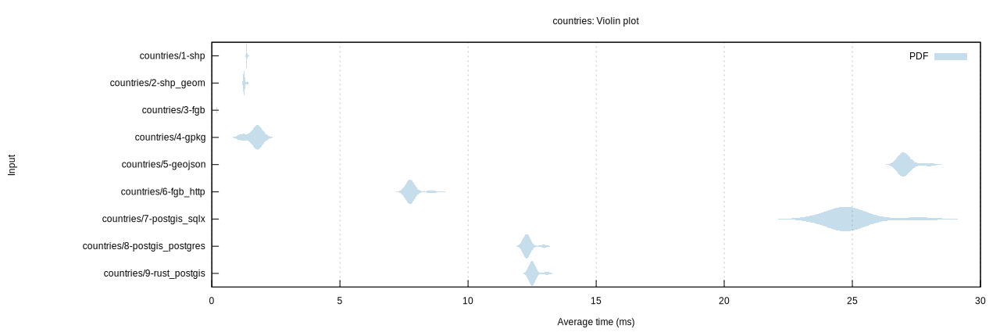
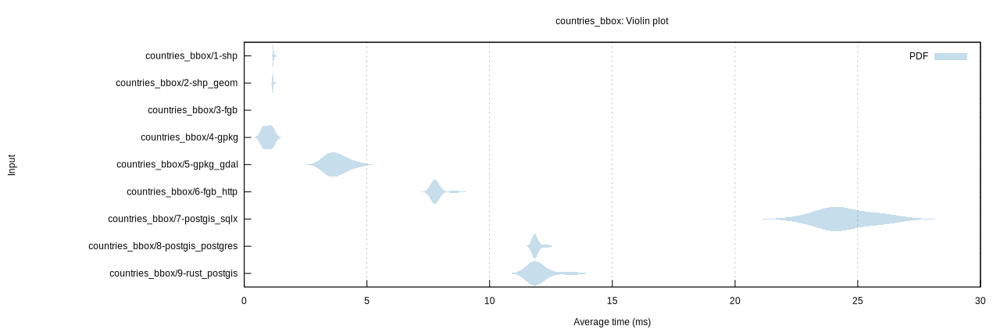
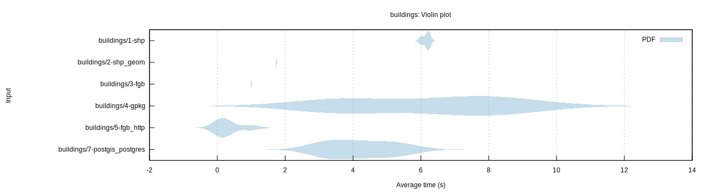

# GeoZero benchmark

## Benchmarks

* `countries`: Read all countries of the world as generalized polygons (GPKG size: 324KB)
* `countries_bbox`: Read 6/179 countries within a bounding box
* `buildings`: Read 2.4 Mio OSM building polygons (GPKG size: 764MB)
* `buildings_bbox`: Read 55'000 OSM building polygons within a bounding box

## Tested configurations

*  `shp`: Shapefile with GDAL driver
*  `shp_geom`: Shapefile with GDAL driver (geometries only)
*  `fgb`: FlatGeobuf file with Rust driver and GeoZero processor for `geo`
*  `gpkg`: GeoPackage file with GeoZero GPKG reader for [SQLx](https://github.com/launchbadge/sqlx) and processor for `geo`
*  `gpkg_gdal`: GeoPackage file with GDAL driver
*  `geojson`: GeoJSON file with GDAL driver
*  `fgb_http`: FlatGeobuf over HTTP (Nginx) with Rust driver and GeoZero processor for `geo`
*  `postgis_sqlx`: PostgreSQL DB with GeoZero PostGIS reader for [SQLx](https://github.com/launchbadge/sqlx) and processor for `geo`
*  `postgis_postgres`: PostgreSQL DB with GeoZero PostGIS reader for [rust-postgres](https://github.com/sfackler/rust-postgres) and processor for `geo`
*  `rust_postgis`: PostgreSQL DB with [rust-postgis](https://github.com/andelf/rust-postgis) reader for [rust-postgres](https://github.com/sfackler/rust-postgres)

Remark: All data is converted from the FlatGeobuf file and therefore has the same ordering.

## Results

| Benchmark | Median (ms) |
| --------- | ----------: |
| countries/1-shp | 1.36 |
| countries/2-shp_geom | 1.26 |
| countries/3-fgb | 0.19 |
| countries/4-gpkg | 1.77 |
| countries/5-geojson | 26.98 |
| countries/6-fgb_http | 7.74 |
| countries/7-postgis_sqlx | 24.74 |
| countries/8-postgis_postgres | 12.29 |
| countries/9-rust_postgis | 12.50 |

| Benchmark | Median (ms) |
| --------- | ----------: |
| countries_bbox/1-shp | 1.18 |
| countries_bbox/2-shp_geom | 1.16 |
| countries_bbox/3-fgb | 0.03 |
| countries_bbox/4-gpkg | 0.97 |
| countries_bbox/5-gpkg_gdal | 3.73 |
| countries_bbox/6-fgb_http | 7.77 |
| countries_bbox/7-postgis_sqlx | 24.08 |
| countries_bbox/8-postgis_postgres | 11.84 |
| countries_bbox/8-rust_postgis | 12.02 |
| countries_bbox/9-rust_postgis | 11.81 |

| Benchmark | Median (s) |
| --------- | ---------: |
| buildings/1-shp | 6.21 |
| buildings/2-shp_geom | 1.74 |
| buildings/3-fgb | 0.99 |
| buildings/4-gpkg | 6.87 |
| buildings/7-postgis_postgres | 4.20 |

| Benchmark | Median (ms) |
| --------- | ----------: |
| buildings_bbox/1-shp | 176.20 |
| buildings_bbox/2-shp_geom | 67.63 |
| buildings_bbox/3-fgb | 73.46 |
| buildings_bbox/4-gpkg | 110.74 |
| buildings_bbox/5-gpkg_gdal | 140.51 |
| buildings_bbox/7-postgis_sqlx | 150.57 |
| buildings_bbox/8-postgis_postgres | 131.18 |
| buildings_bbox/9-rust_postgis | 139.12 |

## Running the benchmark

Prepare data:

    cd tests/data
    make

Create PostGIS database:

    make createdb
    make countries_table osm_buildings_table

Start web server:

    docker-compose up -d
    cd ../..

Run benchmark:

    export DATABASE_URL=postgresql://$USER@localhost/geozerobench
    cargo bench
